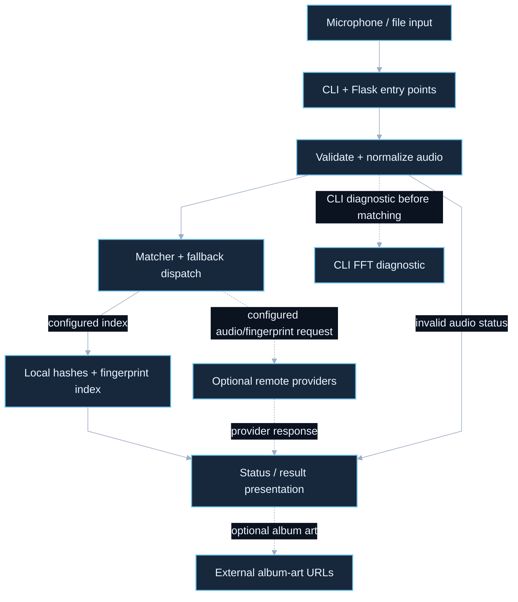

# Audio Recognition: architecture case study

CLI and Flask inputs share a bounded audio contract and configurable recognition backends.

Source snapshot: `2671ccab1802f330083f122561e7ab6c2718dd9f`. Reviewed on **2026-10-03**. This describes the selected committed source, excluding unrelated uncommitted work in the canonical checkout. It is not a runtime, provider, deployment or security certification.

## Overview

[Editable Mermaid](overview.mmd). Solid edges show the core flow; dashed edges show optional or separately invoked paths. Diagram connections summarize control/data flow rather than a complete import graph.

## Main flow

A user records or uploads audio through the CLI or Flask interface. The shared recorder validates duration and encoding, then normalizes samples. The dispatcher attempts RapidAPI, AcoustID, AudD, then the local matcher, skipping missing configuration and stopping on success or a terminal result: remote provider adapters send audio or derived fingerprints when enabled, while the local backend searches constellation hashes against a configured index. Results become stable public statuses and CLI or browser output. The CLI runs FFT diagnostics before matching and stops on diagnostic failure; the web route omits FFT.

## Engineering decision

Use one audio contract and one result contract across CLI, browser and recognition backends. This keeps validation and recovery behavior consistent while allowing provider fallback. The tradeoff is dependence on provider catalogs or a locally prepared fingerprint index rather than guaranteed recognition.

## Source map

| Component | Review path |
| --- | --- |
| Microphone / file input | [main.py](../../main.py) |
| CLI + Flask entry points | [web/app.py](../../web/app.py) |
| Validate + normalize audio | [shazam_project/recorder.py](../../shazam_project/recorder.py) |
| Matcher + fallback dispatch | [shazam_project/matcher.py](../../shazam_project/matcher.py) |
| Local hashes + fingerprint index | [shazam_project/fingerprint.py](../../shazam_project/fingerprint.py) |
| Optional remote providers | [shazam_project/matcher.py](../../shazam_project/matcher.py) |
| CLI FFT diagnostic | [shazam_project/fft_analyze.py](../../shazam_project/fft_analyze.py) |
| External album-art URLs | [shazam_project/display.py](../../shazam_project/display.py) |
| Status / result presentation | [web/static/app.js](../../web/static/app.js) |

## Boundaries and limitations

- The local matcher needs an index; remote providers need credentials and may receive the submitted audio when invoked. This differs from Launchpad browser-local audio processing.
- FFT output is diagnostic, not the recognition algorithm. Browser history is session-only; product accounts and persistent history are not implemented.
- No recognition accuracy, latency benchmark, credentialed provider result or public deployment was verified here.

## GitDiagram provenance

GitDiagram draft dated 2026-09-19 and the existing detailed Mermaid/PNG are retained. The reviewed overview emphasizes shared normalization, provider transmission and diagnostic boundaries.

[GitDiagram reference](https://gitdiagram.com/icecold009/Audio-Recognition) · [Repository](https://github.com/icecold009/Audio-Recognition)

The compact overview is a source-reviewed adaptation authored for this snapshot and rendered locally, not an unmodified GitDiagram export. Existing detailed assets remain at [Mermaid](audio-recognition.mmd) and [PNG](audio-recognition.png).

## Interview explanation

> The interesting part is the shared audio and result contracts, not an FFT picture. CLI and Flask normalize inputs consistently, and the matcher isolates local fingerprinting from optional provider adapters. Real accuracy still needs a lawful corpus and measured evaluation.

## Verification and refresh

Documentation-only acceptance: validate every relative source link and commit-specific diagram link, render Mermaid, inspect the dark PNG for readability, inspect the complete diff, and obtain a bounded Jev diff review. The repository proposal contains no new binary images; separately delivered PNG previews are independently checked because Jev reviews text. Results and Jev coverage are recorded in this task’s delivery report rather than treated as application test evidence.

After an architecture change, inspect the new source, update this snapshot identifier, regenerate the overview from Mermaid, and recheck links and image appearance. Keep planned integrations explicitly separate from implemented paths.

## Review status

Integration is pending warning resolution. Earlier Jev uncertainty has not been accepted or waived. The proposed repository changes are text only, including embedded Mermaid; PNG previews are separate delivery outputs. Source claims describe this committed snapshot. The coverage register accounts for tracked paths and does not prove every execution path or deployed behavior.

## Detailed coverage

See [the subsystem diagram and complete tracked-file register](coverage.md) and [editable detail Mermaid](detail.mmd). This supplement records recovery, optional services, delivery boundaries and original-checkout drift beyond the overview.

[Documentation verification record](verification.md).

Source clarification: the CLI invokes FFT diagnostics before matching and stops on a diagnostic error. The web match route does not invoke FFT. When artwork is returned, the CLI display and browser can request its external image URL separately from recognition.
