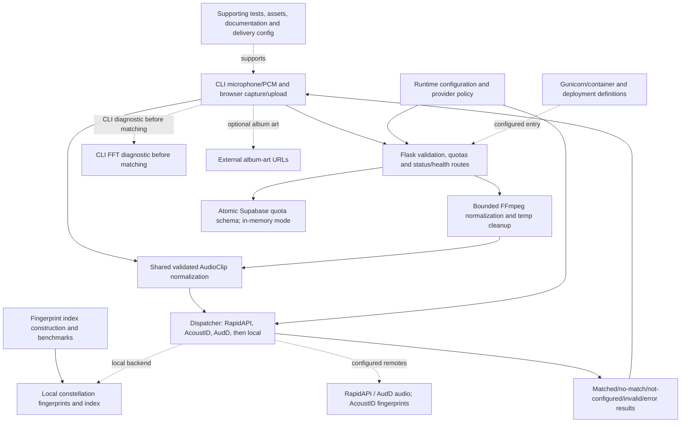

# Subsystem coverage register

Snapshot: `2671ccab1802f330083f122561e7ab6c2718dd9f`. The overview is intentionally compact; this detail layer accounts for the selected Git-tracked tree. Inventory coverage is not proof of every behavior, dynamic dependency, ignored file or deployed system. Nodes group modules rather than reproducing every function. Credentials, local datasets and generated dependencies are excluded.

## Flow and boundary notes

- The CLI captures PCM/WAV; the web upload path normalizes supported formats with bounded FFmpeg execution and temporary-file cleanup. Both paths reach the shared AudioClip normalization and matcher contract. The CLI always performs FFT diagnostics before matching and returns on diagnostic failure. The web match route skips FFT; FFT is not itself the song-identification algorithm.
- The dispatcher attempts RapidAPI, AcoustID, AudD, then the local matcher, skipping unavailable configuration and stopping on a match or other terminal result. It is not local-first. RapidAPI/AudD can receive audio; AcoustID receives derived fpcalc fingerprints. The local backend uses its constellation index. These are separate privacy and network boundaries.
- Status, health and readiness routes differ from recognition success. Quota enforcement can use memory or the atomic Supabase schema. Container/render configuration describes packaging, not verified hosting; benchmark/index scripts are offline tooling.

## Original checkout differences

Pre-existing changed paths at audit: `M supabase/config.toml`, `M web/templates/index.html`. This documentation targets the commit above; these unrelated changes remain in the original checkout.

## File accounting

69 tracked paths, each assigned exactly once below. Supporting items remain explicit without becoming runtime services. Root dependency/build/CI files and otherwise unassigned support files are in DELIVERY; that bucket must be inspected for misclassified runtime modules.

### UI: CLI microphone/PCM and browser capture/upload (7)

- `main.py`
- `shazam_project/display.py`
- `shazam_project/recorder.py`
- `web/static/app.js`
- `web/static/style.css`
- `web/static/typography.css`
- `web/templates/index.html`

### API: Flask validation, quotas and status/health routes (1)

- `web/app.py`

### CONVERT: Bounded FFmpeg normalization and temp cleanup (0)

External or cross-cutting concept; source is shared with other nodes.

### DIAG: CLI FFT diagnostic before matching (1)

- `shazam_project/fft_analyze.py`

### FP: Local constellation fingerprints and index (1)

- `shazam_project/fingerprint.py`

### MATCH: Dispatcher: RapidAPI, AcoustID, AudD, then local (1)

- `shazam_project/matcher.py`

### CONFIG: Runtime configuration and provider policy (2)

- `shazam_project/__init__.py`
- `shazam_project/config.py`

### QUOTA: Atomic Supabase quota schema; in-memory mode (3)

- `supabase/.gitignore`
- `supabase/config.toml`
- `supabase/migrations/20260801145213_production_rate_limits.sql`

### TOOLS: Fingerprint index construction and benchmarks (7)

- `evaluation/sources.example.csv`
- `scripts/__init__.py`
- `scripts/benchmark.py`
- `scripts/build_fingerprint_index.py`
- `scripts/evaluation.py`
- `scripts/record_benchmark.py`
- `scripts/update_readme.py`

### RUN: Gunicorn/container and deployment definitions (4)

- `Dockerfile`
- `compose.yaml`
- `gunicorn.conf.py`
- `render.yaml`
### TEST (16)

- `tests/__init__.py`
- `tests/conftest.py`
- `tests/test_audio_pipeline.py`
- `tests/test_benchmark.py`
- `tests/test_ci_hardening.py`
- `tests/test_config.py`
- `tests/test_core.py`
- `tests/test_deployment.py`
- `tests/test_display.py`
- `tests/test_fingerprint.py`
- `tests/test_providers.py`
- `tests/test_rate_limits.py`
- `tests/test_recorder.py`
- `tests/test_reproducible_benchmark.py`
- `tests/test_web.py`
- `tests/test_web_pipeline.py`

### DOC (17)

- `LICENSE`
- `README.md`
- `TODO.md`
- `docs/01-product-requirements.md`
- `docs/02-technical-requirements.md`
- `docs/03-app-flow.md`
- `docs/04-ui-ux-design-brief.md`
- `docs/05-backend-schema.md`
- `docs/architecture/audio-recognition.mmd`
- `docs/architecture/audio-recognition.png`
- `docs/screenshots/fft-output.png`
- `evaluation/README.md`
- `showcase/audio-recognition/case-study.md`
- `showcase/audio-recognition/diy-shazam-showcase.pptx`
- `showcase/audio-recognition/evidence-checklist.md`
- `showcase/audio-recognition/presentation-outline.md`
- `showcase/audio-recognition/presentation-script.md`

### ASSET (0)

None in this snapshot.

### DELIVERY (9)

- `.dockerignore`
- `.env.example`
- `.gitattributes`
- `.github/container_smoke_wsgi.py`
- `.github/workflows/ci.yml`
- `.gitignore`
- `pyproject.toml`
- `requirements-dev.txt`
- `requirements.txt`

Source clarification: the CLI invokes FFT diagnostics before matching and stops on a diagnostic error. The web match route does not invoke FFT. When artwork is returned, the CLI display and browser can request its external image URL separately from recognition.
