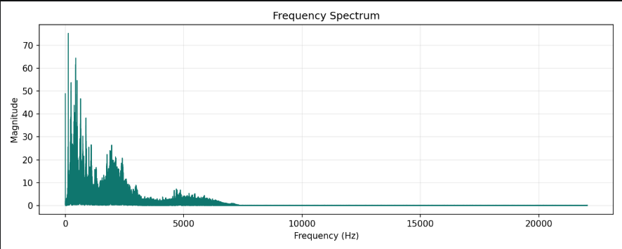
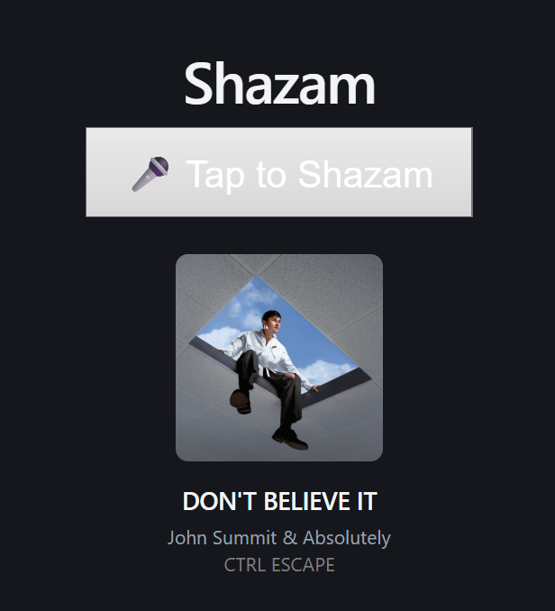

<div align="center">

[](https://github.com/icecold009/audio-recognition/actions/workflows/ci.yml)
[](https://codecov.io/gh/icecold009/audio-recognition)

<br/>

**Identify any song from your microphone or an audio file.**  
FFT analysis · Multi-backend matching · Flask web UI · Terminal output


</div>

***
<div align="center">
  <h1 style="margin:0;padding:0">Audio Recognition</h1>
  <p style="margin:4px 0 8px;color:#1E90FF">Identify songs from your microphone or an audio file — FFT + multi-backend matching</p>
</div>

## Overview
DIY Shazam captures audio (mic or file), creates a frequency spectrum (FFT), and identifies tracks using RapidAPI/Shazam, AcoustID, AudD, or a locally built constellation-hash fingerprint index. A compact Flask web UI enables browser uploads.

## Performance

| Metric | Result |
|--------|--------|
| Average recognition time (RapidAPI backend) | ~2.1 s |
| Average recognition time (AudD backend) | ~3.4 s |
| Test set accuracy | X / Y songs matched correctly |
| Sample audio length required | 8 s (configurable) |
| Platforms tested | Windows 11, Ubuntu 22.04, macOS 14 |

## Architecture
```mermaid
flowchart LR
  A[CLI / Web UI] --> B[Audio Input\n(mic or upload)]
  B --> C[FFT Analysis\n(saves fft_output.png)]
  B --> D[Write WAV temp]
  D --> E{Matcher Backends}
  E -->|RapidAPI| F[Shazam]
  E -->|AcoustID| G[AcoustID]
  E -->|AudD| H[AudD]
  E -->|Local hashes| I[Local fingerprint index]
  F & G & H & I --> J[Normalized Result]
  J --> K[Display (CLI) / JSON (Web)]
  classDef blue fill:#ffffff,stroke:#1E90FF,stroke-width:2px,color:#1E90FF;
  class A,B,C,D,E,F,G,H,I,J,K blue;
```
Theme: black / white / blue — white nodes with a professional DodgerBlue accent (#1E90FF).

## Quickstart
1) Create & activate a venv:
```powershell
python -m venv .venv
.\.venv\Scripts\Activate.ps1
```
2) Install runtime deps:
```powershell
pip install -r requirements.txt
```
3) Add configuration:
```powershell
copy .env.example .env
# edit .env to add AUDD_API_TOKEN or other keys
```
4) Run CLI:
```powershell
python main.py
```
5) Run web UI (dev):
```powershell
python web/app.py
# open http://127.0.0.1:5000
```

## Project Structure
Core source modules now live under `shazam_project/`:

- `shazam_project/config.py`
- `shazam_project/recorder.py`
- `shazam_project/fft_analyze.py`
- `shazam_project/matcher.py`
- `shazam_project/display.py`

Entrypoints remain:

- `main.py` (CLI)
- `web/app.py` (Flask web app)

## Configuration
Supported env vars (see `shazam_project.config.load_config()`): `AUDD_API_TOKEN`, `ACOUSTID_API_KEY`, `FP_CALC_PATH`, `RAPIDAPI_KEY`, and optional `LOCAL_FINGERPRINT_INDEX`. Matcher order: RapidAPI → AcoustID → AudD → local fingerprint index.

## Web UI
`web/app.py` exposes `/api/match` for uploads and `/api/status` for tool/backend checks. Non-WAV uploads are converted with `ffmpeg` if present.

## Testing
Run the Python tests and coverage locally:
```powershell
python -m pytest -q
python -m coverage run --branch --source=shazam_project,web,scripts -m pytest -q
python -m coverage report
```
`tests/` covers FFT image creation, mocked provider flows, dispatcher fallback, web routes, and synthetic local fingerprint index matching.

GitHub Actions runs pytest on every push and pull request across Python 3.10, 3.11, and 3.12. A Python 3.12 coverage job enforces at least 50% total coverage across the Python packages and benchmark scripts, publishes `coverage.xml` as an artifact, and uploads it to Codecov. The frontend job also runs ESLint and a production build.

For the real-world comparison, see [`evaluation/README.md`](evaluation/README.md). It records speaker-to-microphone clips at 4, 8, and 15 seconds, builds the local landmark-hash index from clean source tracks, and compares the local backend against all three provider backends.

## Limitations

Recognition is not guaranteed outside the happy path. The main failure modes are:

- **Background noise and recording quality:** speech, room echo, speaker distortion, very low volume, clipping, or music mixed with other sounds can hide the spectral peaks used by fingerprinting.
- **Catalog coverage:** a provider can only return tracks in its database, while the local matcher can only identify tracks present in its local fingerprint index. A `no_match` result does not prove that the audio is invalid.
- **Language and regional catalog differences:** the fingerprinting itself is not English-specific, but provider metadata and catalog coverage vary by language, region, release, and recording availability.
- **Live, cover, remix, and alternate versions:** crowd noise, changed instrumentation, tempo or pitch, medleys, and different arrangements may fail to match or may be returned as the closest studio recording rather than the exact performance.

The evaluation dataset is designed to measure these cases separately. Until that dataset is recorded and run through all configured backends, the README does not claim a general accuracy percentage.

## Notes & Tips
- Record in a quiet space and keep the mic near the audio source.
- For AcoustID, install Chromaprint (`fpcalc`): macOS `brew install chromaprint`, Debian/Ubuntu `apt install libchromaprint-tools`.
- `ffmpeg` is optional for the web upload conversion path.

## Contributing
Pull requests are welcome. For major changes, open an issue first.
Run `python -m pytest -q` and `python -m coverage report` before submitting.

***

## Example Output

```
Listen via microphone or load a file? (mic/file): mic

Recording for 8 seconds...
FFT analysis saved to fft_output.png

Song:    Blinding Lights
Artist:  The Weeknd

[Album art opens in image viewer]
```

FFT spectrum for a sample clip:





***

## Web API Reference

| Endpoint       | Method | Description                                           |
|----------------|--------|-------------------------------------------------------|
| `/api/match`   | POST   | Upload an audio file for recognition. Returns JSON.  |
| `/api/status`  | GET    | Reports configured backends, ffmpeg, fpcalc status.  |

**Example — cURL:**
```bash
curl -X POST http://localhost:5000/api/match \
  -F "file=@song.wav"
```

**Example — Response:**
```json
{
  "status": "matched",
  "title": "Blinding Lights",
  "artist": "The Weeknd",
  "album": "After Hours",
  "image": "https://..."
}
```

`status` is one of: `matched` · `no_match` · `no_token` · `error`

***

## Notes

- Record in a **quiet environment** for best accuracy
- CLI mic mode requires a working input device; the web UI uses browser microphone
- File mode (CLI) accepts WAV by default; the web UI converts other formats via `ffmpeg` if available
- Tested on Windows, macOS, and Linux

***

## Roadmap

- [x] Add CI — run pytest + coverage + frontend lint/build on every push and pull request
- [ ] CLI flags: `--mode`, `--duration`, `--file` for unattended/scripted use
- [ ] Local match history saved as JSON
- [ ] `--no-open-image` flag for headless environments
- [ ] Structured logging in `shazam_project/matcher.py` for easier debugging
- [ ] End-to-end Flask test using the test client with a sample WAV

***

## License

[MIT](LICENSE) — free to use and modify.
